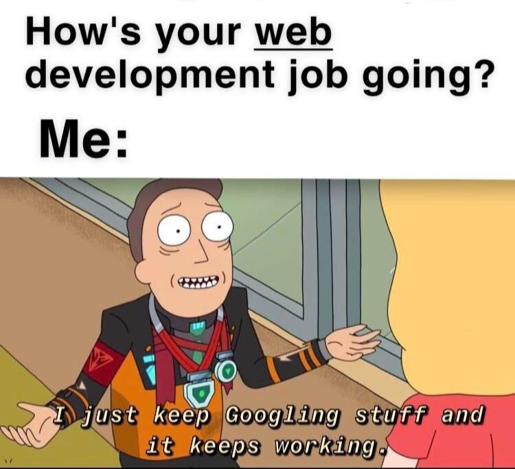
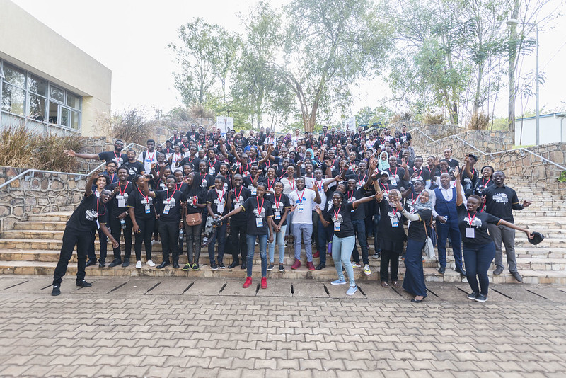

_Caption : My crew , un groupe des developeur qui m’ont fait plaisir: [Kart Musingo](https://github.com/Karlmusingo): G3 ULPGL, [Hadad Bwenge](https://www.linkedin.com/in/hadad-bwenge-345ba7103) : , [Vicent Mutonmo](https://www.linkedin.com/in/glody-mutombo) (ULK), [Grace Lungu](https://rw.linkedin.com/in/grace-lungu-262306190) (East African University Kampala) among the best Engineer we had back in the days at Andela._

Je me rappelle il y a cinq ans, je finissais mes études universitaires et à l'époque je rêvais de travailler dans une soi-disant Startup, car je lisais sur les réseaux sociaux que les startups faisaient le buzz à Kigali. À l'époque Je n'avais rien à mettre sur mon CV, je n’avais même pas suffisamment de connaissances dans des langages de programmation, que ce soit en Java ou en aucun autre d’ailleurs, et Dieu merci, c’est avec ce peu de connaissances que j'ai débuté ma carrière en développement informatique, mais je présume que cela n'est pas le cas pour mes petits frères et sœurs qui sont en train de finir leurs études aujourd'hui : c'est la raison pour laqu­elle Je me suis décidé d'écrire cet article, pour aider ceux qui cherchent à se faire une carrière dans notre domaine.

Il sera structuré de la manière suivante :
* Que faire lorsqu'on est encore l'université ?
* Que  faire après ses études universitaires ?
* Que  faire après son premier travail ?
* Quel profil les entreprises recherchent parmi les candidats ?

Bien que la plupart des conseils de cet article soient valables pour le domaine de l’informatique et de la programmation en particulier, certains d’entre eux sont également applicables pour n’importe quelle autre carrière.

##  First Thing First : 

Pour vous rassurer j'aimerais vous dire une réalité fondamentale :

Les entreprises ont besoin des personnels qualifiés,  de bons développeurs et ces derniers sont et resteront rares pour les jours  à venir. Une chose est sûre, soyez confiant, si vous êtes qualifié les entreprises vous chercheront. 

La grande question est comment se qualifier ?

##  L’Anglais Langage Par Excellence 

Avant tout, pour une bonne carrière en développement informatique, ou en informatique en général, pour l'amour du ciel, je le répète pour l'amour du Ciel : APPRENEZ L'ANGLAIS, APPRENEZ L'ANGLAIS, LEARN ENGLISH PEOPLE. 

Vous n'irez nulle part avec la langue Française en informatique. Même les Français et les Belges qui nous ont appris cette langue, utilisent l'anglais comme langue d’apprentissage de l'informatique. 

Que faire si vous n'êtes pas  à l'aise avec la langue de Shakespeare ? :

Pour ceux qui ont eu la chance de faire de bonnes écoles secondaires comme moi, nous avons déjà une bonne base en anglais, c'est déjà un bon départ. 

Néanmoins, pour tout le monde, le mieux à faire c’est de chercher des clubs d’anglais et de les rejoindre. Là vous allez rencontrer des gens qui vont vous stimuler à apprendre et parler couramment l’anglais. Il y en a plein, presque dans toutes les universités du pays(RDC). 

À la limite, soyez à l'aise pour lire et comprendre un tutoriel en anglais. Le reste viendra avec un processus continu de pratique quotidienne. Personnellement cela m'a pris trois ans pour être à l’aise avec l’anglais. 

## Tirez profits de vos Cours à l'université

On aura beau dire que nos programmes universitaires ne sont pas à jour, ou même qu’ils ne sont pas adaptés, mais ce sont ces mêmes programmes qui nous donnent une bonne base. Je suis toujours  reconnaissant pour les cours que j'ai appris à l’université en RDC.

Mes cours d'Algorithmiques, de programmation orientée objet en Java, des bases des données en général, de génie logiciel, ont été une bonne fondation pour ma carrière en développement informatique. 

Et au-delà de ces cours, soyez curieux, ne vous limitez pas à apprendre pour avoir des pourcentages élevés ou pour vous limiter à passer un examen, lisez ici et là pour apprendre plus de ce que les autres apprennent. 

Plus le temps passera, plus vous serez surpris de ce que vous aurez appris. Défiez vos enseignants en allant au-delà de ce qui vous est transmis à l'université. 

Les cours vous permettront d’avoir ce qu’on appelle les **hard skills**, mais en plus de hard skills, une des compétences que j’ai acquis après l'université, ce sont les **softs skills**. 

## Les Softs Skills pour vous différencier

En plus des cours à l'université, ne sous-estimer jamais les petits clubs qu'on a ici et là, que ça soit à l'église, à la fac ou au sein de la communauté en général.  Elles nous donnent ce qu'on appelle  dans le monde professionnel : le leadership, l’expérience et les soft skills. 

Au sein des organisations estudiantines et des clubs, vous acquérez les softs skills. C’est là où vous pouvez apprendre à travailler en équipe,  à communiquer,  à gérer les conflits ou à gérer toute sorte de personnalité. C’est le genre d'expérience qui vous sera très utile tout au long de votre vie. Apprenez aussi à être discipliné, ponctuel, à communiquer avec les clients, ces genres de petites qualités vous permettront de faire la différence dans un monde ou tout le monde semble les ignorer.  

Avez-vous eu l’occasion de devenir chef de promotion ? Membre du gouvernement estudiantin ? Ne ratez jamais ces genres d’occasions. Elles vous ajouteront quelques lignes à mettre sur votre CV. 

## Faites connaître votre travail.

Une fois ces connaissances acquises, hard et soft skills, comment les gens sauront que vous les avez ? Travailler sur votre réputation en ligne.  Si vous n'avez pas un compte Github, s’il vous plait arrêtez de lire ce post et aller en créer un, puis revenez au post. 

Une fois que vous aurez un compte GitHub, que mettre sur celui-ci ? Si vous êtes encore à la fac, travailler sur un TFC ou un mémoire qui vous permettra d’apprendre des projets qui vous seront utiles. Apprenez des plus et soyez curieux, ajoutez tout ce qui vous vient en tête dans le projet. Éviter la paresse et le fait d'écrire un travail juste pour avoir des points. Vos travaux sont les premiers projets que vous présenterez  à vos employeurs. Ayez l’habitude de mettre n’importe quel projet sur lequel vous travaillez en ligne. 

C’est un système de gestion de la boutique de votre tante maternelle que vous avez conçu ? Postez-le, on ne sait jamais.

## Soyez Curieux et Apprenez à Googler

Soyez curieux et apprenez à poser des questions : Voulez vous apprendre quelque chose, une simple requête google peut vous faire tomber sur 2 ou 3 ressources utiles.   Je ne peux pas vous dire comment apprendre à être curieux, car je ne sais pas comment on le fait. 

## L'importance de la communauté  (Networking)

Rejoignez les communautés locales ou virtuelles vous y apprendrez beaucoup. Créez  un compte Twitter et rejoignez des groupes de discussion. Mais éviter de passer trop de temps sur des réseaux sociaux lorsque vous travaillez, ce sont de grands bouffeurs de temps. 

Rejoignez Une communauté. Les communautés de développeurs existent partout dans le pays et vous pouvez les rejoindre gratuitement. À Lubumbashi, il y des mouvements tels que [ltot Africa](https://itot.africa/), ou DevsCast. À Goma nous avons[ Uptodate Developers](https://uptodatedevelopers.com/) et autres. A Kinshasa nous avons [Kinshasa Digital Academy](https://www.kinshasadigital.com/) et tant d’autres, récemment à Bukavu nous avons vu Google developer group, etc Nous avons [Abel Mbula](https://www.abelmbula.com/) qui f­ait du bon travail à Kisangani.  Il y a aussi diverses communautés en ligne comme freeCodeCamp, [dev.to](https://dev.to/), Codenwebie.

Ces genres de communautés offrent des opportunités de network, en les côtoyant, Dieu sait ce que vous pouvez avoir comme réseaux. Comme le dit un vieil adage swahili de chez nous, **mutu ni batu**, Une personne, c’est d’autres personnes.

## Que cherchent les entreprises ?

Avec des profils en ligne, avec deux ou trois projets en ligne, que ce que les entreprises cherchent d’autre auprès des développeurs ? 

Les entreprises n'ont rien à faire de vos études, de vos projets, de vos connaissances. No one care, Je répète, ils s’en moquent. 

Ce qui les intéresse, c’est comment vos connaissances peuvent résoudre leurs problèmes. C’est  la chose fondamentale à savoir pour avoir une carrière dans ce domaine. Vous devez chercher à savoir les problèmes que les entreprises ont et leur dire comment vos connaissances leur seront utiles. C’est tout.

 

## Quel langage de programmation Apprendre

Je ne veux pas me mettre à faire un débat sur les langages dans ce poste ni même dire quel langage est meilleur que l'autre, c’est hors cadre.

Une chose est sure, le concept de la logique programmation existe depuis toujours et ne changera jamais comme les Algorithmes et les structures des données, les bases du HTTP, les Bases des données ou le Génie logiciel. 

Les langages viennent et partent. Mais ce concept est là depuis des années et reste là. Un bon ouvrier est quelqu'un qui sait utiliser l'outil adapté au problème. Si vous voulez faire dans le développement web, apprenez le  Javascript c'est incontourna­ble, pour les data science le Python est le langage par excellence. 

Le dernier conseil que je peux donner est de maîtriser au moins un langage de programmation et le reste viendra de soi-même. 

## Allons nous y arriver? 
  

Soyez sûr que vous  y arriverez, il y a de jeunes formé aux pays qui ont eu la chance d'émerger en tant que développeur au niveau international, la liste est longue, mais je peux citer ceux qui me viennent en tête.

[David Kathoh](https://cd.linkedin.com/in/davidkathoh), [Premices Nzanzu](https://github.com/nkpremices), [Pacifique ​​LINJANJA ](https://github.com/pacyL2K19) , [Lucien Makutano](https://ke.linkedin.com/in/makutano-lucien), [Benjamin Kafirongo,](https://rw.linkedin.com/in/benjamin-kafirongo-b8b290128) my guy [Michael Rukamakama](https://cd.linkedin.com/in/michael-rukamakama-07a45b186), ma bande des gars de Kigali,  toute la bande des gars de Lushi (la liste est longue, mais ils font du bon travail), et tous les autres devs qui trouvent leurs noms dans [le top 10 de la liste suivante](https://commits.top/congo.html). Vous faites la fierté du pays.

## Conclusion :

Pendant mes études universitaires je n’ai pas eu des professionnels expérimentés dans mon domaine pour me prodiguer ces genres des conseils, mais vous avez la chance de m’avoir moi. 🤪 j’espère que vous en tirerez profit. Si vous êtes à la fac et avez certaines astuces pour avoir une bonne carrière en programmation, faites nous savoir. S’il y a certains points avec lesquels vous n’êtes pas d’accord dans mon poste faite moi savoir. Si vous avez d’autres points à ajouter dans le blog, veuillez les partager en commentaire. 

Cheers 🤲🏼
